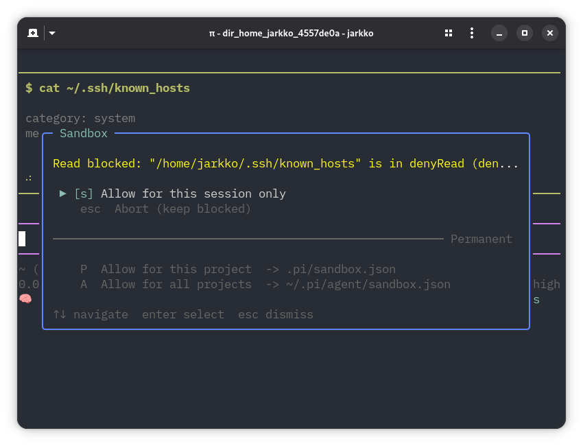

# pi-landstrip



Landlock-based sandboxing for [pi](https://pi.dev/) using
[`landstrip`](https://github.com/jarkkojs/landstrip).

## Install

```bash
pi install npm:pi-landstrip
```

This installs `pi-landstrip` and its `@jarkkojs/landstrip` dependency, which
includes platform-specific native binaries for Linux, macOS, and Windows.

On unsupported platforms the extension loads but leaves sandboxing disabled.

## Configure

Create `.pi/sandbox.json` in a project or `~/.pi/agent/sandbox.json` globally.
Project config takes precedence.

See [`sandbox.json`](./sandbox.json) for a starter config.

Use Pi settings to toggle sandboxing:

```json
{
  "landstrip": {
    "enabled": false
  }
}
```

Project Pi settings override global Pi settings.
The `/sandbox` UI updates the project setting when present, otherwise the global setting.

## Usage

Use `/sandbox` inside Pi to show the active config and toggle the Pi setting.

## License

`pi-landstrip` is licensed under `MIT`. See [LICENSE](LICENSE) for more
information.

The bundled `@jarkkojs/landstrip` package is licensed under
`Apache-2.0 AND LGPL-2.1-or-later`.
